# Stochastic reserving using analytic (closed form), bootstrap, and "Bayesian" MCMC methods

_This code is provided by Peter England on behalf of EMC Actuarial and Analytics Ltd as an educational resource._

This repository includes stochastic reserving functions in R (with R Markdown) and Python (with Jupyter) to reproduce the examples in:

England \& Verrall (2006). ___Predictive distributions of outstanding liabilities in general insurance___. Annals of Actuarial Science, 1, II, 221-270. https://doi.org/10.1017/S1748499500000142

and

England, Verrall \& Wüthrich (2018/2019). ___On the lifetime and one-year views of reserve risk, with application to IFRS 17 and Solvency II risk margins___. Insurance: Mathematics and Economics (2019) https://doi.org/10.1016/j.insmatheco.2018.12.002. A preprint is also available at SSRN (2018) https://ssrn.com/abstract=3141239

England \& Verrall (2006) shows how predictive distributions of outstanding liabilities in general insurance can be obtained using bootstrap or 'Bayesian' MCMC techniques for clearly defined statistical models.

England, Verrall \& Wüthrich (2018/2019) brings together analytic and simulation-based approaches to reserve risk, applied to the traditional actuarial view of risk over the lifetime of the liabilities and to the one-year view of Solvency II. It also connects the lifetime and one-year views of risk. Predictive distributions are used to estimate risk margins under Solvency II and risk adjustments under IFRS 17.

Also included is an example *modus operandi* for stochastic reserving when faced with a new claims triangle. The example shows the steps to go through and the exhibits to explore to understand what is driving variability.

The functions and examples include the following:

- Methods for the lifetime and one-year (and beyond) views of risk
- Analytic (closed form), bootstrap, and 'Bayesian' MCMC approaches
- Mack's model, the overdispersed Poisson chain ladder model (with constant and non-constant scale parameters), and the overdispersed negative binomial chain ladder model (with constant and non-constant scale parameters)
- Cost-of-Capital risk margins for Solvency II
- Risk adjustments for IFRS 17 using risk measures applied to the distribution of discounted outstanding liabilities
- Sensitivity analysis to identify influential data points

Also included are the following useful features:

- Parametric bootstrapping options, in addition to the traditional non-parametric approach
- User-defined scale (variance) parameters at the forecasting stage for bootstrap and MCMC methods
- Scaling of simulated reserves to target estimates of ultimate claims using multiplicative or additive scaling

**Specific details for Python and R can be found in the README files in their respective folders.**

*The code is provided as-is and may contain errors. Questions and reporting of issues to peter@emc-actuarial.com are welcome but there is no active support and a response is not guaranteed.*

## Example exhibits:

Incremental claims triangle:
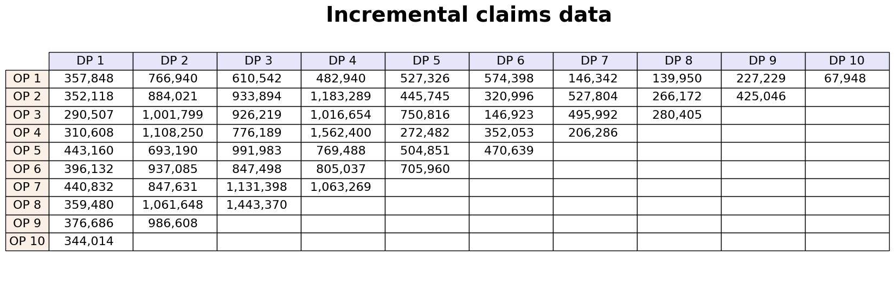

Incremental claims graph:
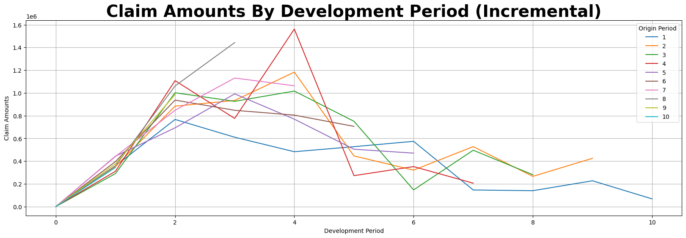

Cumulative claims graph:
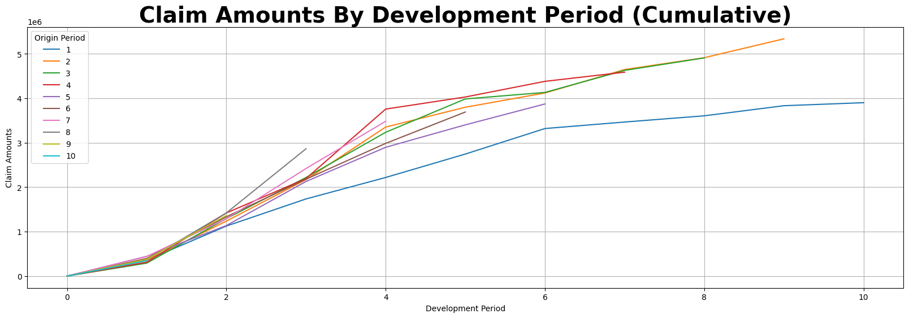

Link ratios triangle, with volume-weighted chain ladder development factors:
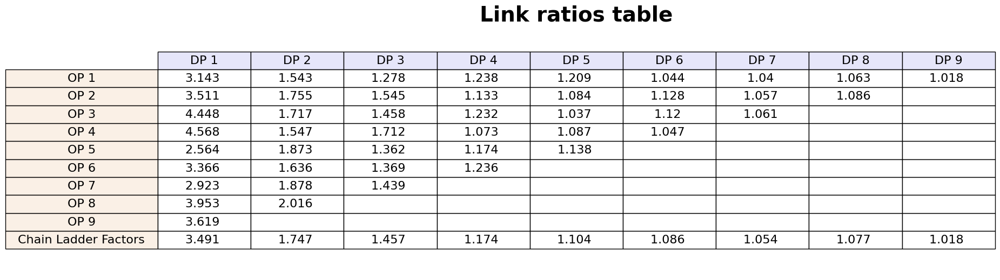

Link ratios graph:
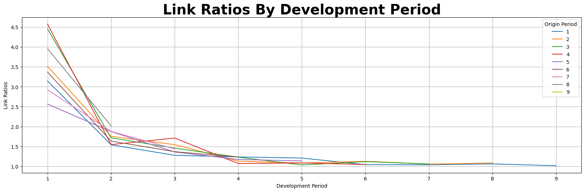

Analytic results:
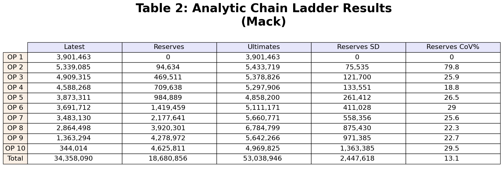

Bootstrap results for the lifetime and one-year views of risk:
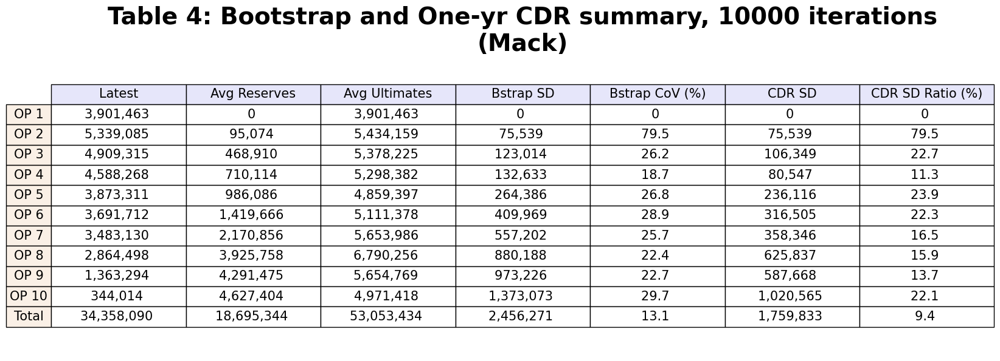

Sequence of one-year views of risk, connecting the one-year view with the lifetime view:
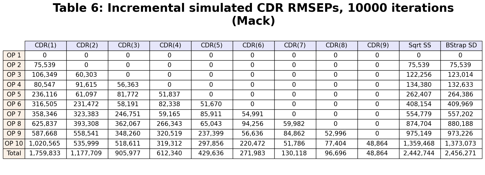

Example reserve development (fan) chart for a single origin year:
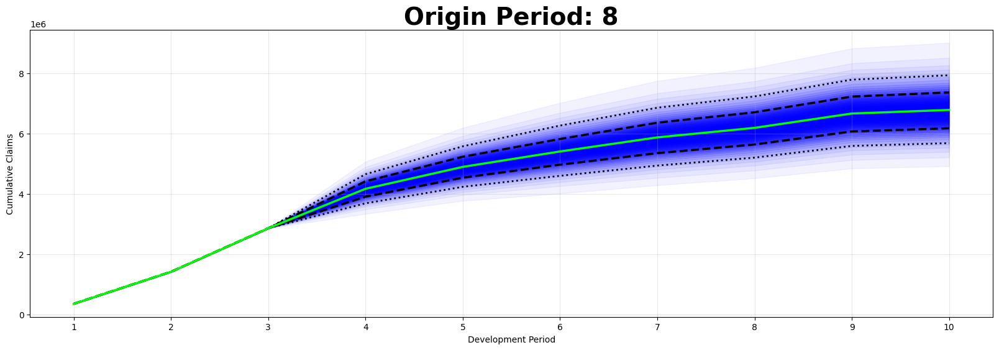

Solvency II cost-of-capital risk margin:
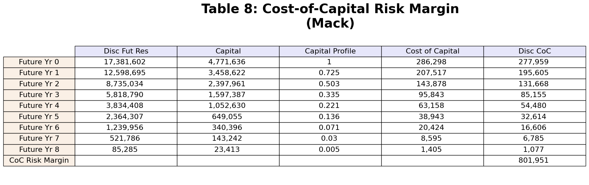

IFRS 17 risk adjustments using risk measures applied to the distribution of discounted outstanding liabilities:
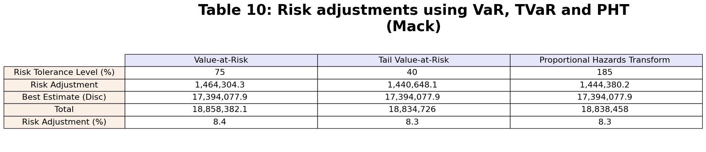

IFRS 17 risk adjustments equivalent to a cost-of-capital risk margin:
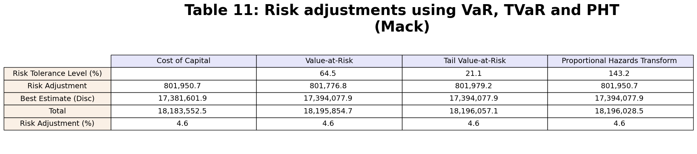

Cost-of-capital future capital profiles under different bases:
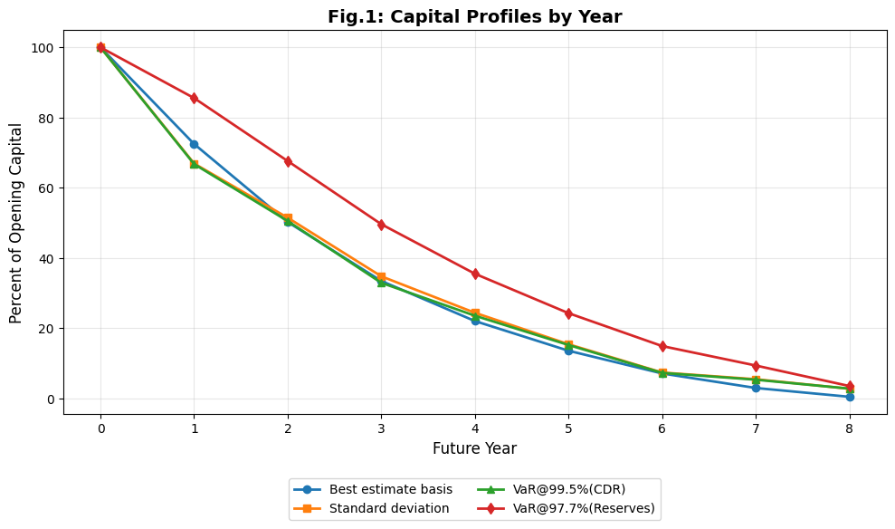

### 'Bayesian' MCMC results

Maximum likelihood vs MCMC parameter estimates:
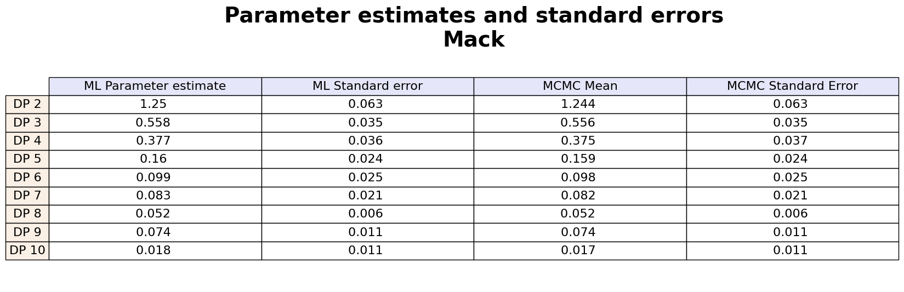

MCMC vs Bootstrap results summary:
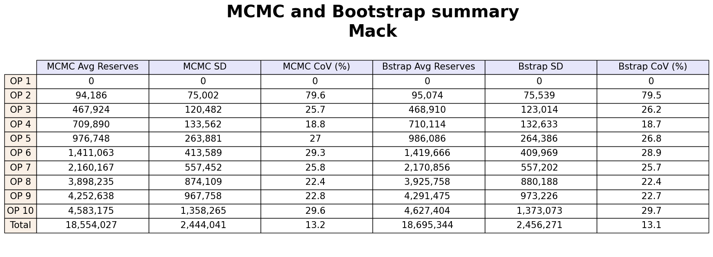

Residuals by development period, with Mack's sigma (variance) parameters
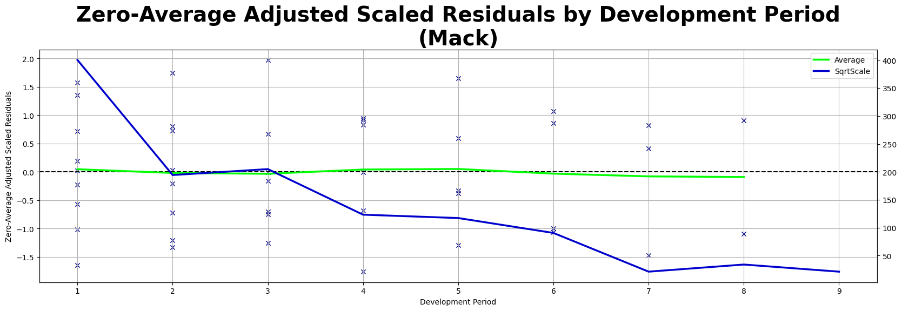

